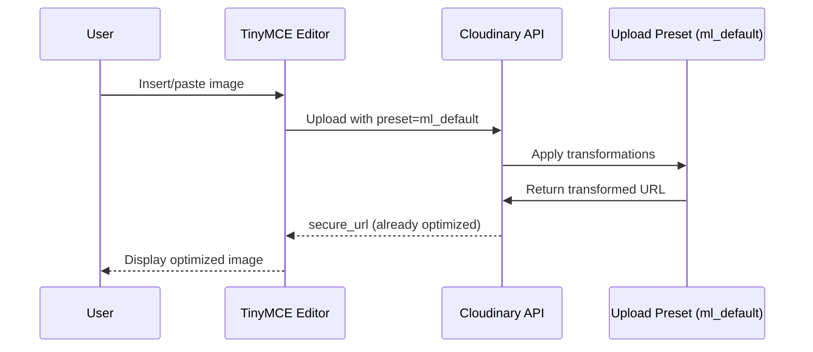

# Design Document: Cloudinary TinyMCE Upload Fix

## Overview

Fix the Cloudinary image upload error in TinyMCE editor by switching from client-side URL transformation to server-side upload preset configuration. The current implementation applies transformation parameters (`c_limit,w_800,q_auto,f_auto`) to the returned URL when using unsigned uploads, which Cloudinary doesn't allow. The solution is to configure these transformations in the Cloudinary upload preset itself, so images are automatically optimized without client-side URL manipulation.

## Main Algorithm/Workflow



## Core Interfaces/Types

```typescript
interface BlobInfo {
  blob: () => File;
  filename: () => string;
}

interface CloudinaryUploadResult {
  secure_url: string;
  public_id: string;
  bytes: number;
  resource_type: string;
}

interface CloudinaryUploadRequest {
  file: File;
  upload_preset: string;
}
```

## Key Functions with Formal Specifications

### Function 1: imageUploadHandler()

```typescript
async function imageUploadHandler(blobInfo: BlobInfo): Promise<string>
```

**Preconditions:**
- `blobInfo` is non-null and contains a valid image file
- `blobInfo.blob()` returns a valid File object
- `NEXT_PUBLIC_CLOUDINARY_CLOUD_NAME` environment variable is set
- Cloudinary upload preset `ml_default` exists and is configured with transformations

**Postconditions:**
- Returns a valid HTTPS URL string pointing to the uploaded image
- The returned URL points to an image that is already optimized (no client-side transformation needed)
- If upload fails, throws an Error with descriptive message
- No side effects on input blobInfo

**Loop Invariants:** N/A (no loops in function)

## Algorithmic Pseudocode

### Main Upload Algorithm

```typescript
ALGORITHM imageUploadHandler(blobInfo)
INPUT: blobInfo of type BlobInfo
OUTPUT: imageUrl of type string

BEGIN
  ASSERT blobInfo !== null
  ASSERT typeof process.env.NEXT_PUBLIC_CLOUDINARY_CLOUD_NAME === 'string'
  
  // Step 1: Extract file from blobInfo
  file ← blobInfo.blob()
  
  // Step 2: Prepare upload request
  cloudName ← process.env.NEXT_PUBLIC_CLOUDINARY_CLOUD_NAME
  uploadPreset ← 'ml_default'
  
  formData ← new FormData()
  formData.append('file', file)
  formData.append('upload_preset', uploadPreset)
  
  // Step 3: Upload to Cloudinary
  uploadResponse ← fetch(
    `https://api.cloudinary.com/v1_1/${cloudName}/image/upload`,
    { method: 'POST', body: formData }
  )
  
  // Step 4: Handle upload response
  IF NOT uploadResponse.ok THEN
    errorText ← uploadResponse.text()
    THROW Error('Upload failed: ' + errorText)
  END IF
  
  result ← uploadResponse.json()
  
  ASSERT result.secure_url !== undefined
  ASSERT result.secure_url.startsWith('https://')
  
  // Step 5: Return URL directly (no transformation)
  RETURN result.secure_url
END
```

**Preconditions:**
- blobInfo contains valid image data
- Cloudinary credentials are configured
- Upload preset exists with proper transformations

**Postconditions:**
- Returns valid HTTPS URL
- URL points to optimized image (transformations applied by preset)
- Throws error if upload fails

**Loop Invariants:** N/A

## Example Usage

```typescript
// Example 1: Basic usage in TinyMCE editor
const editor = new Editor({
  images_upload_handler: imageUploadHandler,
  // ... other config
});

// Example 2: Upload flow
const blobInfo = {
  blob: () => new File([imageData], 'image.jpg', { type: 'image/jpeg' }),
  filename: () => 'image.jpg'
};

const imageUrl = await imageUploadHandler(blobInfo);
// imageUrl = "https://res.cloudinary.com/[cloud]/image/upload/v123456/[public_id].jpg"
// Transformations already applied by preset, no URL manipulation needed

// Example 3: Error handling
try {
  const url = await imageUploadHandler(blobInfo);
  console.log('Upload success:', url);
} catch (error) {
  console.error('Upload failed:', error.message);
}
```

## Correctness Properties

*A property is a characteristic or behavior that should hold true across all valid executions of a system-essentially, a formal statement about what the system should do. Properties serve as the bridge between human-readable specifications and machine-verifiable correctness guarantees.*

### Property 1: URL returned without modification

*For any* valid Cloudinary upload response, the Image_Upload_Handler SHALL return the secure_url value directly without any string manipulation or transformation parameter insertion

**Validates: Requirements 1.1, 1.2, 1.3**

### Property 2: HTTPS URL validation

*For any* successful upload response, the returned URL SHALL start with `https://` protocol

**Validates: Requirements 4.2**

### Property 3: Error thrown on upload failure

*For any* non-OK HTTP status response from Cloudinary, the Image_Upload_Handler SHALL throw an Error containing the error text from the response

**Validates: Requirements 3.1, 3.2**

### Property 4: Secure URL presence validation

*For any* upload response, if secure_url is missing from the response, the Image_Upload_Handler SHALL throw an Error

**Validates: Requirements 4.1, 4.3**

### Property 5: Return value is secure_url string

*For any* valid upload response, the Image_Upload_Handler SHALL return exactly the secure_url string value and nothing else

**Validates: Requirements 4.4**

### Property 6: Upload preset consistency

*For any* upload request, the form data SHALL contain upload_preset field with value `ml_default`

**Validates: Requirements 5.1**

### Property 7: Endpoint URL format

*For any* cloud name configuration, the upload endpoint URL SHALL match the format `https://api.cloudinary.com/v1_1/{cloudName}/image/upload`

**Validates: Requirements 5.3**

### Property 8: Form data completeness

*For any* upload request, the form data SHALL contain both the file field and the upload_preset field

**Validates: Requirements 5.4**

## Error Handling

### Error Scenario 1: Upload Failure

**Condition:** Cloudinary API returns non-OK status (4xx or 5xx)
**Response:** Throw Error with message including the error text from Cloudinary
**Recovery:** TinyMCE will display error to user; user can retry upload

### Error Scenario 2: Missing Environment Variable

**Condition:** `NEXT_PUBLIC_CLOUDINARY_CLOUD_NAME` is undefined
**Response:** Upload will fail with fetch error
**Recovery:** Developer must configure environment variable; application should validate this at startup

### Error Scenario 3: Invalid Upload Preset

**Condition:** Upload preset `ml_default` doesn't exist or is misconfigured
**Response:** Cloudinary returns 400 error
**Recovery:** Developer must create/configure the preset in Cloudinary dashboard

### Error Scenario 4: Network Failure

**Condition:** Network request to Cloudinary fails
**Response:** Fetch throws network error
**Recovery:** User can retry upload when network is restored

## Testing Strategy

### Unit Testing Approach

- Mock Cloudinary API responses to test success and error paths
- Verify URL format of returned values
- Test error message formatting
- Verify no URL transformation is applied

### Property-Based Testing Approach

**Property Test Library**: fast-check (TypeScript)

- Generate random valid image files and verify URL format
- Generate random error responses and verify error handling
- Verify that returned URLs never contain transformation parameters

### Integration Testing Approach

- Test actual upload to Cloudinary with test account
- Verify uploaded images have correct transformations applied
- Test with various image formats (JPEG, PNG, GIF, WebP)
- Verify images display correctly in TinyMCE editor

## Configuration Requirements

### Cloudinary Upload Preset Configuration

The `ml_default` upload preset must be configured in Cloudinary dashboard with:

**Transformation Settings:**
- Mode: `limit` (resize to fit within bounds)
- Width: `800` pixels
- Quality: `auto` (automatic quality optimization)
- Format: `auto` (automatic format selection - WebP for supported browsers)

**Upload Settings:**
- Signing mode: `unsigned`
- Folder: (optional, can be configured)
- Allowed formats: `jpg`, `jpeg`, `png`, `gif`, `webp`

**Example Cloudinary Preset Configuration:**
```json
{
  "name": "ml_default",
  "unsigned": true,
  "transformation": [
    {
      "width": 800,
      "crop": "limit",
      "quality": "auto",
      "fetch_format": "auto"
    }
  ]
}
```

## Dependencies

- `@tinymce/tinymce-react`: TinyMCE React component
- Cloudinary account with configured upload preset
- Environment variable: `NEXT_PUBLIC_CLOUDINARY_CLOUD_NAME`

## Security Considerations

- Unsigned uploads are appropriate for user-generated content in admin interface
- Upload preset restricts allowed transformations and formats
- Consider adding file size limits in the preset configuration
- Consider adding allowed file type restrictions in TinyMCE configuration

## Performance Considerations

- Images are optimized server-side by Cloudinary (no client-side processing)
- Automatic format selection (WebP) reduces bandwidth
- Quality optimization maintains visual quality while reducing file size
- Width limit (800px) ensures reasonable file sizes for web display
