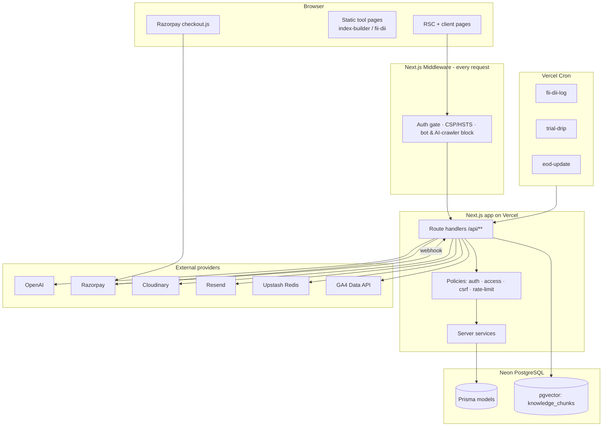
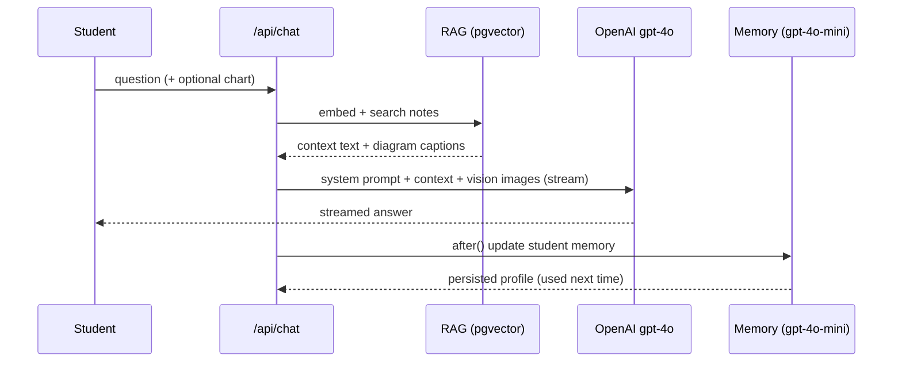
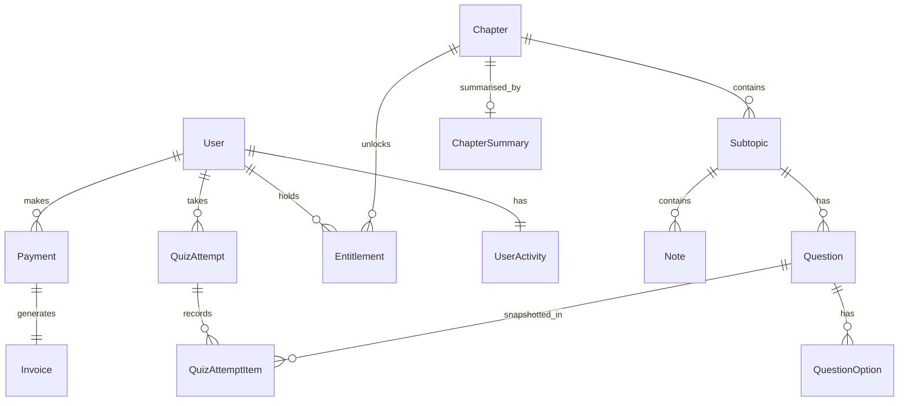
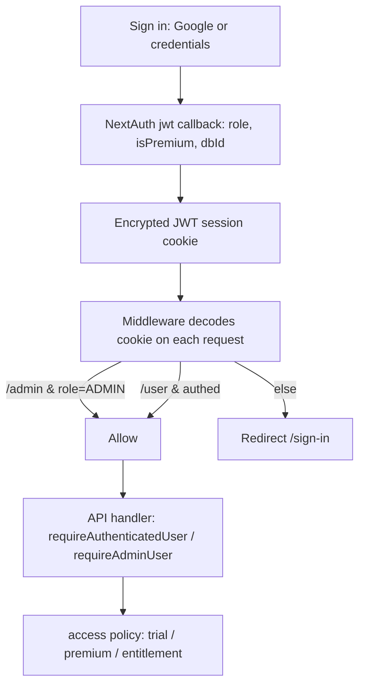
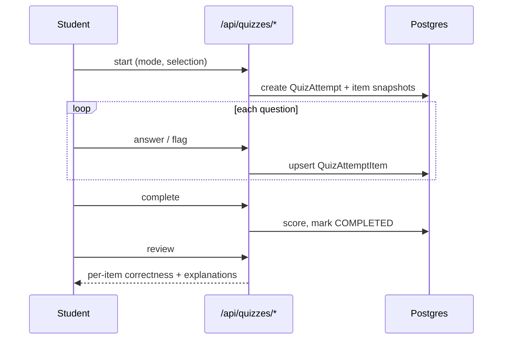
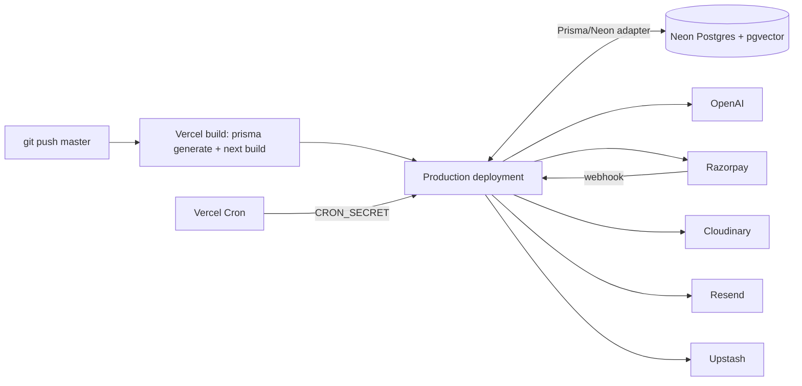
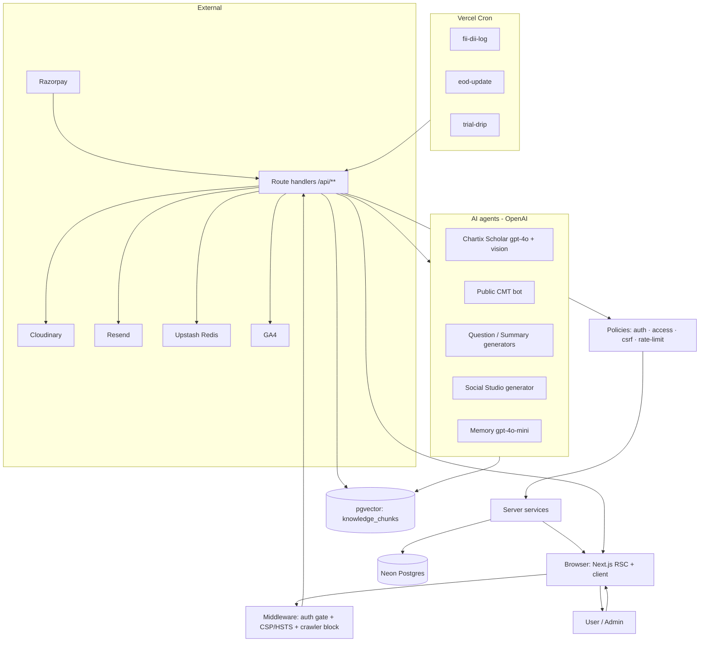

# Chartix

> **Chartix.in** is a paid, AI-assisted learning platform for the **CMT® (Chartered Market Technician) exam** — the global professional designation in technical analysis. It combines a structured curriculum (chapters → subtopics → notes → questions), a full quiz/mock-test engine, an AI study tutor grounded in the platform's own materials via retrieval-augmented generation, interactive market tools (Indicator Lab, FII/DII dashboard, custom Index Builder), a freemium trial + Razorpay billing funnel, a blog, and an admin content-authoring + social-media studio — all in one Next.js application.

**Live:** [chartix.in](https://chartix.in) · **Audience:** CMT candidates worldwide (all three levels) · **Type:** Single-tenant SaaS web app.

> CMT® and Chartered Market Technician® are registered trademarks of the CMT Association. Chartix is not affiliated with, endorsed by, or sponsored by the CMT Association.

---

## Table of Contents

1. [Project Overview](#1-project-overview)
2. [Product Features](#2-product-features)
3. [Technology Stack](#3-technology-stack)
4. [System Architecture](#4-system-architecture)
5. [Repository / Folder Structure](#5-repository--folder-structure)
6. [Internal Working](#6-internal-working)
7. [AI Bots / AI Agents](#7-ai-bots--ai-agents)
8. [AI Architecture and Implementation](#8-ai-architecture-and-implementation)
9. [API Documentation](#9-api-documentation)
10. [Database Architecture](#10-database-architecture)
11. [Authentication & Authorization](#11-authentication--authorization)
12. [Important User Flows](#12-important-user-flows)
13. [External Integrations](#13-external-integrations)
14. [Security](#14-security)
15. [Error Handling & Reliability](#15-error-handling--reliability)
16. [Performance & Scalability](#16-performance--scalability)
17. [Environment Configuration](#17-environment-configuration)
18. [Local Development Setup](#18-local-development-setup)
19. [Deployment Architecture](#19-deployment-architecture)
20. [Testing](#20-testing)
21. [Technical Design Decisions](#21-technical-design-decisions)
22. [Future Improvements](#22-future-improvements)
23. [Complete End-to-End Architecture](#23-complete-end-to-end-architecture)

---

## 1. Project Overview

Chartix is a **CMT exam-preparation LMS**. A candidate signs up, gets a 7-day free trial, studies richly-formatted notes organised by the CMT curriculum, practises with quizzes and full mock tests, asks an AI tutor ("Chartix Scholar") about any concept — including uploading their own charts for analysis — and upgrades to paid access via Razorpay. Admins author all content (notes, questions, chapter revision summaries, blog posts) through a dashboard, moderate user reports, manage coupons/users, and generate social-media carousels and market-data report images from a built-in "Social Studio".

### The problem it solves

The CMT curriculum is broad and technical, and quality prep material is scarce. Chartix packages a structured, exam-focused curriculum with:

- **Notes that teach**, not textbooks — authored in a rich editor, watermarked, with embedded diagrams.
- **Practice that mirrors the exam** — MCQ banks, timed mock tests, flagging, review, and analytics on weak/strong topics.
- **A tutor that never leaves the curriculum** — an AI grounded (via RAG) in the platform's own notes, with admin-authored "mandatory corrections" that override the model.

### Who it is for

- **Students / candidates** (role `USER`) preparing for CMT Level I, II, or III — a **global** audience.
- **Admins** (role `ADMIN`) — the Chartix team authoring content and running the business.

### Main use cases

Study notes → practise quizzes → ask the AI tutor → track performance → subscribe. On the admin side: author curriculum → generate/QA questions with AI → publish → moderate reports → market the product.

### Key capabilities

- Curriculum CMS with soft-delete, ordering, publish gating, and per-chapter access control.
- Full quiz engine with attempt snapshots, flagging, review, and analytics.
- RAG-based AI tutor with vision (chart uploads + note-diagram attachment) and per-student memory.
- Freemium trial, Razorpay payments (verify + webhook), coupons, entitlements, GST-ready PDF invoices.
- Interactive, mostly-static market tools + live FII/DII data pipeline.
- Admin Social Studio (AI carousel generation + FII/DII report images).

### What makes it technically interesting

- **pgvector RAG inside Postgres** — embeddings live in the same Neon database as the app data, queried with raw `<=>` cosine distance; no separate vector store.
- **Vision-aware tutoring** — the tutor attaches the *right* note diagram (caption-matched) as vision input, or analyses a student-uploaded chart, under strict "education-only, never trading advice" guardrails.
- **Idempotent dual-path payments** — a fast client-verify path and a webhook source-of-truth, both idempotent, both granting the same access.
- **Defence-in-depth security** — middleware CSP + HSTS + scraper/AI-crawler blocking, DOMPurify sanitisation, hashed password-reset tokens, CSRF origin checks, and Upstash rate limiting.

---

## 2. Product Features

### 2.1 Curriculum & Notes (student-facing)

- **What:** Content is a three-level tree — **Chapter → Subtopic → Note** — scoped by `CmtLevel` (LEVEL_1/2/3). Notes are authored in TinyMCE and stored as both `contentJson` (source of truth) and rendered `contentHtml`, with an optional `watermarkConfig`.
- **How users interact:** Browse by level/chapter/subtopic under `/user/notes`; access is gated by trial/premium/entitlement.
- **Internally:** `chapter.service.ts`, `subtopic.service.ts`, `note.service.ts` back the read APIs; publish/soft-delete flags (`isPublished`, `isDeleted`) control visibility.

### 2.2 Quiz & Mock-Test Engine

- **What:** Practice in modes `SUBTOPIC`, `CHAPTER`, `CUSTOM`, `FULL_TEST` (`QuizMode`). Each attempt (`QuizAttempt`) stores per-item **snapshots** (`QuizAttemptItem.questionSnapshotJson`) so a later edit to a question never changes a past attempt. Items support two-colour flagging (`YELLOW`/`RED`), timing, and review.
- **How users interact:** `/user/quiz` → start → answer → flag → complete → review.
- **Internally:** `/api/quizzes/start`, `/answer`, `/complete`, `/review`, `/flag` (all under `quiz.service.ts`); results feed the analytics service.

### 2.3 Chartix Scholar — AI study tutor

- **What:** An in-app tutor (`/api/chat`) that answers CMT questions in a fixed teaching structure, embeds relevant diagrams from the student's own notes, analyses **uploaded charts** with vision, and adapts to the student via per-user memory + quiz performance. See [§7](#7-ai-bots--ai-agents).
- **Access:** Trial users get a capped number of questions/day (`TRIAL_SCHOLAR_DAILY`); paid/admin are unlimited. Chart uploads are separately capped (15/day).

### 2.4 Chapter Quick-Revision Summaries

- **What:** Per-chapter revision sheet (`ChapterSummary`) with six sections — summary bullets, key concepts, formulas, exam tips, high-yield facts, one-minute revision — often AI-drafted then admin-published. Students can bookmark individual items (`SummaryBookmark`).
- **How:** `/user/summary`, `/api/chapter-summary/[chapterId]` (+ `/bookmark`).

### 2.5 Personal Analytics

- **What:** Per-student dashboard of attempts, accuracy, weak/strong topics, streaks. Also powers an analytics "coach" and chat (`/api/user/analytics`, `/coach`, `/chat`).
- **Internally:** `analytics.service.ts` reads `QuizAttempt`/`QuizAttemptItem`; the tutor consumes a compact weak/strong summary to tailor teaching.

### 2.6 Market Tools

- **Indicator Lab** (`/tools/[indicator]`) — an educational library of technical indicators.
- **FII/DII Dashboard** (`/tools/fii-dii`) — foreign vs domestic institutional flows (cash + F&O), served from the app's own `FiiDiiLog`/`FnoLog` tables plus static tool assets.
- **Index Builder** (`/tools/index-builder`) — build, weight (equal / market-cap), chart, save, and optionally publish a custom stock index (`Index` model, `shareId` for public sharing).

### 2.7 Freemium Trial, Payments & Access

- **Trial:** 7-day trial set on first sign-in (`trialStartedAt`/`trialExpiresAt`, `subscriptionStatus=TRIAL`). Trial-free chapters flagged via `Chapter.isTrialFree`.
- **Payments:** Razorpay checkout → server order → client verify + webhook → `Payment` marked `PAID` → premium granted → PDF invoice emailed. Billing details (incl. GST) captured at checkout.
- **Coupons:** two kinds (`Coupon`) — **free-access** (grants `Entitlement` for N days on specific/all chapters) and **price-discount** (`PERCENT`/`FIXED` off checkout).
- **Drip:** `trial-drip` cron emails trial-day nudges (idempotent via `UserActivity.lastDripDay`).

### 2.8 Blog & Lead Capture

- **What:** SEO blog (`/blog`, `/blog/[slug]`, `BlogPost`) with subscriber capture (`BlogSubscriber`, token-based unsubscribe) and a public homepage chatbot.
- **Contact & feedback:** `ContactSubmission`, `BotFeedback`, and `CandidateFeedback` (structured feedback the CMT Association can request from Prep Providers).

### 2.9 Admin Console

Under `/admin/*` (ADMIN-only): chapters, subtopics, notes (rich editor + image upload/autolabel), questions (+ AI generation), chapter summaries, blog, coupons, users, contacts, note/question report moderation, the two chatbots' knowledge & Q&A corrections, and **Social Studio** (AI carousel generation + FII/DII report images).

---

## 3. Technology Stack

| Layer | Technology | Purpose |
|---|---|---|
| Framework | **Next.js 15** (App Router) | SSR/RSC pages, route handlers, middleware |
| UI | **React 19** + **TypeScript** | Server + client components |
| Styling | **Tailwind CSS** + `@tailwindcss/typography` | Design system, prose |
| Rich text | **TinyMCE** (`@tinymce/tinymce-react`) + **TipTap** (`@tiptap/*`) | Note/question authoring |
| ORM | **Prisma 6** | Schema, migrations, typed queries |
| Database | **Neon PostgreSQL** (serverless driver `@neondatabase/serverless` + `@prisma/adapter-neon`) | Relational data |
| Vector search | **pgvector** (raw `<=>` queries via Prisma `$queryRawUnsafe`) | RAG over notes + public docs |
| Auth | **NextAuth v5** (`next-auth@5-beta`) — Google OAuth + Credentials | Sessions (JWT), roles |
| Password hashing | **bcryptjs** | Credentials login + reset |
| AI | **OpenAI** — `gpt-4o` (chat/vision), `gpt-4o-mini` (memory), `text-embedding-3-small` (1536-dim) | Tutor, generators, embeddings |
| Rate limiting | **Upstash Redis** + `@upstash/ratelimit` (sliding window) | Abuse/cost control |
| Payments | **Razorpay** (`razorpay` SDK + checkout) | Subscriptions |
| Invoices | **pdf-lib** | GST-ready PDF invoices |
| Email | **Resend** | Transactional (welcome, invoice, reset, drip, contact) |
| Media | **Cloudinary** (signed uploads) | Note images, PDFs |
| Doc ingest | **pdf-parse** | Public-bot knowledge from PDFs |
| Sanitisation | **isomorphic-dompurify** | XSS defence on rendered HTML |
| Validation | **Zod** + `react-hook-form` + `@hookform/resolvers` | Input schemas, forms |
| Data fetching | **@tanstack/react-query** | Client cache/state |
| Studio export | **html-to-image** + **jszip** | Client-side PNG/zip carousel export |
| Report images | **`next/og` `ImageResponse`** (satori + resvg) | Server-rendered FII/DII report PNGs |
| Analytics | **Vercel Analytics**, **GA4** (`@next/third-parties`, Data API) | Product + admin analytics |
| Hosting | **Vercel** (+ Vercel Cron) | Deploy, edge, scheduled jobs |
| Tooling | ESLint, Prettier | Lint/format |

> **Not present / not used** (don't assume): no Supabase (the `.env.example` still references it, but the code uses Neon + NextAuth), no Redux, no GraphQL, no separate backend service, no dedicated vector database (pgvector is inside Postgres), no Docker/CI config in-repo, and **no automated test suite** (see [§20](#20-testing)).

---

## 4. System Architecture

### 4.1 High-level

Chartix is a **single Next.js application** deployed on Vercel. There is no separate backend — the "backend" is Next.js **route handlers** (`src/app/api/**/route.ts`) and **server services** (`src/server/services/*`), all talking to Neon Postgres via Prisma. External providers (OpenAI, Razorpay, Cloudinary, Resend, Upstash, GA4) are called server-side.



### 4.2 Frontend architecture

App Router with **route groups**: `(auth)` (sign-in/up, reset), `(dashboard)` (`/user/*`, `/admin/*`), and top-level marketing/legal/tool pages. Server Components fetch data directly; client components use React Query and call `/api` handlers. The market tools (`/tools/fii-dii`, `/tools/index-builder`) are largely **static HTML/JS** assets in `public/` rendered inside same-origin iframes.

### 4.3 Backend architecture

Three layers inside the app:

1. **Route handlers** (`src/app/api/**`) — HTTP ent/exit, validation, response shaping.
2. **Policies** (`src/server/policies/*`) — `auth` (require authenticated/admin), `access` (trial/premium/entitlement), `csrf` (origin allowlist), `rate-limit` (Upstash).
3. **Services** (`src/server/services/*`) — business logic + Prisma (`chapter`, `subtopic`, `note`, `question`, `quiz`, `analytics`, `dashboard`, `media`).

### 4.4 API layer

REST-style JSON handlers, grouped: `api/admin/*` (ADMIN), `api/user/*` + feature routes (authenticated), `api/auth/*`, `api/payments/*`, `api/cron/*` (CRON_SECRET), and a few public ones (`api/public-chat`, `api/blog/*`, `api/contact`). See [§9](#9-api-documentation).

### 4.5 Database layer

Neon Postgres via Prisma, using the **serverless adapter** (`@prisma/adapter-neon` + `ws`) so it works on Vercel's serverless runtime. RAG uses a `knowledge_chunks` table with a pgvector `embedding` column queried by raw SQL.

### 4.6 AI/agent architecture

Multiple stateless LLM "agents", each an API route or lib function with its own system prompt (tutor, public bot, question generator, summary generator, image autolabel, studio, analytics coach). RAG context comes from pgvector. See [§7](#7-ai-bots--ai-agents)–[§8](#8-ai-architecture-and-implementation).

### 4.7 Background jobs

Three **Vercel Cron** endpoints (bearer-authenticated with `CRON_SECRET`): `fii-dii-log` (ingest daily flows), `eod-update` (end-of-day market update, weekdays), `trial-drip` (trial nudge emails). Plus `after()` fire-and-forget work inside request handlers (memory updates, engagement counters).

### 4.8 Communication between components

In-process function calls (route → policy → service → Prisma). Cross-cutting state (sessions) rides in the NextAuth JWT cookie, decoded in middleware without a DB call. External calls are plain HTTPS to provider SDKs/REST.

---

## 5. Repository / Folder Structure

```
chartix/
├── prisma/
│   ├── schema.prisma            # ~30 models/enums: users, curriculum, quizzes, payments, FII/DII, AI
│   └── seed.mjs                 # DB seeding
├── src/
│   ├── middleware.ts            # Auth gate + CSP/HSTS + scraper/AI-crawler blocking (runs on all routes)
│   ├── app/
│   │   ├── (auth)/              # sign-in, sign-up, reset-password
│   │   ├── (dashboard)/
│   │   │   ├── admin/           # ADMIN console (chapters…users, studio) — layout runs requireAdminUser()
│   │   │   └── user/            # student dashboard, notes, quiz, summary, analytics, feedback
│   │   ├── blog/ tools/ about/ pricing/ contact/ terms/ …   # public pages
│   │   └── api/                 # all route handlers (see §9)
│   │       ├── admin/*          # ADMIN CRUD + AI generators + studio + reports
│   │       ├── auth/*           # NextAuth, register, password-reset, session, logout
│   │       ├── chat, public-chat # AI tutor + public homepage bot
│   │       ├── quizzes/*        # quiz engine
│   │       ├── payments/razorpay/* # order, verify, webhook
│   │       ├── chapter-summary/*, chapters/*, notes, me, contact, feedback, blog/*
│   │       ├── fii-dii/*, index-builder/*, index-tools/*   # market tools APIs
│   │       ├── user/*           # dashboard, analytics, trial-status, reports
│   │       └── cron/*           # fii-dii-log, trial-drip, eod-update
│   ├── server/
│   │   ├── policies/            # auth.ts, access.ts, csrf.ts, rate-limit.ts
│   │   ├── services/            # chapter, subtopic, note, question, quiz, analytics, dashboard, media
│   │   └── validators/          # zod schemas (content, admin-content, quiz)
│   ├── lib/
│   │   ├── ai/                  # openai.ts, rag.ts, knowledge-store.ts (pgvector), memory.ts, image-captions.ts, pdf-processor.ts
│   │   ├── auth/                # NextAuth config (auth.ts) + helpers
│   │   ├── payments/            # razorpay.ts (signature verify, grant)
│   │   ├── invoices/            # generate.ts (pdf-lib), send.ts (Resend)
│   │   ├── email/               # Resend client + templates
│   │   ├── studio/              # Social Studio design system, prompts, export, content-plan
│   │   ├── reports/             # FII/DII report data + next/og PNG render
│   │   ├── index-builder/, tools/, chapter-summary/, cloudinary/, security/, seo/, geo/, qod/, db/, utils/
│   └── components/              # UI (admin/, user/, marketing, shared)
├── public/                      # static assets + the fii-dii / index-builder tool apps
├── docs/                        # internal design notes (architecture, api, database, auth, security-audit…)
├── sql/ + *.sql                 # setup scripts (pgvector, invoices, coupons, trial, password-reset…)
├── vercel.json                  # crons + build command (prisma generate && next build)
├── next.config.mjs              # images (Cloudinary), serverExternalPackages, redirects
└── tailwind.config.ts / tsconfig.json / package.json
```

**Key inter-module relationships**

- Every `/admin/*` **page** is protected by the admin layout calling `requireAdminUser()`; every `/api/admin/*` **handler** calls it too (defence in depth).
- `src/lib/ai/rag.ts` is the retrieval brain — it chunks note HTML (preserving image markers), embeds, stores, and searches `knowledge_chunks`; `chat/route.ts` consumes it.
- `src/server/policies/access.ts` centralises the trial/premium/entitlement decision used by content and chat routes.
- `src/lib/payments` + `src/lib/invoices` + `src/lib/email` form the checkout→access→invoice chain.

---

## 6. Internal Working

### 6.1 Request lifecycle (any protected page)

```text
Browser request
   ↓
middleware.ts  ── block scrapers/AI crawlers (UA regex) → 403 if matched
   ↓            ── decode NextAuth JWT from cookie (no DB call)
   ↓            ── /admin/* requires role=ADMIN, /user/* requires auth → else redirect /sign-in
   ↓            ── attach CSP (report-only) + HSTS + security headers
   ↓
App Router (RSC/page or /api route handler)
   ↓
requireAuthenticatedUser() / requireAdminUser()  (server/policies/auth.ts → auth() session)
   ↓
access policy (trial/premium/entitlement) · csrf origin check · rate limit (Upstash)
   ↓
server service → Prisma → Neon Postgres
   ↓
JSON response / rendered RSC
```

### 6.2 AI tutor answer (`/api/chat`) — end to end

```text
Student sends message (+ optional level, chat history, uploaded chart image)
   ↓
requireAuthenticatedUser()  → validate image (type/size), enforce trial/chart rate limits
   ↓
getTrialState() → block if trial ended & not paid; count Scholar question for trial cap
   ↓ (in parallel)
buildContext(message, level)          → embed query → pgvector search notes → text + diagram list
prisma.botQAPair(botType='study')     → admin "mandatory corrections"
getUserMemory(userId)                 → per-student profile
getUserAnalyticsData(userId)          → weak/strong topics
   ↓
buildSystemPrompt(...)  → fixed teaching structure OR chart-analysis structure (if image uploaded)
   ↓
pickVisionImages(): caption-match note diagrams → attach up to 2 as vision input
   ↓
openai.chat.completions.create({ model: gpt-4o, stream: true, temperature: 0.4 })
   ↓ (on vision failure → retry once text-only)
stream tokens back to client (ReadableStream)
   ↓ after(): updateUserMemory() on gpt-4o-mini + increment scholarUsed  (non-blocking)
```

### 6.3 Payment → premium (idempotent, dual-path)

```text
Client: /api/payments/razorpay/order → create Payment(status=CREATED) + Razorpay order
   ↓
Razorpay Checkout modal → user pays
   ↓
Path A (instant): /verify → CSRF check → verify HMAC(order|payment, key_secret)
   ↓                → confirm order belongs to user → if not already PAID:
   ↓                grantPremiumAccess() · Payment=PAID · bump coupon · issueInvoice() · welcome email
Path B (truth):   /webhook → verify webhook signature → same grant, idempotent
```

### 6.4 RAG ingestion (admin publishes/edits a note)

Note HTML → `` tags replaced with space-free markers (URL + caption survive chunking) → strip HTML → word-chunk (size 600, overlap 80) → `text-embedding-3-small` per chunk → `INSERT ... embedding::vector` into `knowledge_chunks`. Search: embed the query → `1 - (embedding <=> $query::vector) > 0.45`, `ORDER BY embedding <=> $query`.

---

## 7. AI Bots / AI Agents

All agents are **stateless server functions** calling OpenAI over the SDK. There is no autonomous multi-step tool-calling loop or agent framework — orchestration is explicit TypeScript. Each agent owns a domain-specific system prompt and, where relevant, RAG grounding + admin overrides.

### 7.1 Chartix Scholar (study tutor) — `src/app/api/chat/route.ts`

| Aspect | Detail |
|---|---|
| **Purpose** | Teach CMT concepts and analyse student charts, grounded in the platform's own notes. |
| **Input** | Message, level, last 8 turns of history, optional uploaded chart image (data URL). |
| **Output** | Streamed markdown in a fixed structure (What is X / Key Principles / Real-World Example / Exam Tips) or a chart-analysis structure. |
| **Model** | `gpt-4o` (vision-capable), `temperature 0.4`, `max_tokens 1200`, **streamed**. Memory updates on `gpt-4o-mini`. |
| **Tools/data** | RAG context (`buildContext`), note-diagram vision attachment (caption-matched, ≤2, `detail:'low'`), uploaded-chart vision (`detail:'high'`), admin Q&A "mandatory corrections", per-user memory, quiz-performance summary. |
| **Decision-making** | Prompt selects concept-explainer vs chart-analysis mode; `pickVisionImages()` scores note captions against the question; admin corrections override everything. |
| **State/memory** | Per-student memory profile (`getUserMemory`/`updateUserMemory`) persisted and re-injected. |
| **Guardrails** | Never give trading/investment advice; never invent facts; no LaTeX (plain Unicode formulas); no emojis; verify uploaded image is actually a chart before analysing. |
| **Error handling** | Vision request failure → retry once text-only; auth/limit errors → typed JSON. |
| **Rate limits** | Trial: `TRIAL_SCHOLAR_DAILY`/day; chart uploads: 15/day — both via Upstash. |
| **Trigger** | Student sends a message in the Scholar UI. |

### 7.2 Public CMT Exam Bot — `src/app/api/public-chat/route.ts`

| Aspect | Detail |
|---|---|
| **Purpose** | Answer general CMT-program questions on the public homepage (lead-gen). |
| **Grounding** | RAG over admin-uploaded documents only (`PublicBotSource` → `knowledge_chunks`, `searchPublicBotChunks`). |
| **Guardrails** | Answer **only** from context; if unknown, direct to cmtassociation.org / sign-up; ≤300 words; plain-text formulas. Admin `BotQAPair(botType='public')` are mandatory facts. |
| **Access** | Public (unauthenticated), rate-limited. |

### 7.3 Question Generator — `src/app/api/admin/generate-questions/route.ts`

Admin-only. Drafts MCQ questions (with options/explanations) for a chapter/subtopic that admins review before publishing. Model: OpenAI. Output feeds the `Question`/`QuestionOption` authoring flow.

### 7.4 Chapter Summary Generator — `src/app/api/admin/chapter-summary/generate/route.ts`

Admin-only. Drafts the six-section `ChapterSummary` (summary, key concepts, formulas, exam tips, high-yield, one-minute) for admin editing/publishing.

### 7.5 Image Auto-Labeller — `src/app/api/admin/notes/[id]/images/autolabel/route.ts`

Admin-only. Uses vision to caption note diagrams so the tutor can later pick the right one for a student's question (captions are the matching key in `pickVisionImages`).

### 7.6 Social Studio content generator — `src/app/api/admin/studio/generate/route.ts`

Admin-only. Generates platform-specific social carousel copy (Instagram/LinkedIn/X/Reddit; Beginner/Practitioner voice) as JSON (`response_format: json_object`, `gpt-4o`). Paired with client-side PNG export (`src/lib/studio/export.ts`) and FII/DII report images (`src/lib/reports`).

### 7.7 Analytics Coach / Chat — `src/app/api/user/analytics/{coach,chat}/route.ts`

Authenticated. Turns the student's quiz analytics into coaching guidance / a conversational view of their performance.

### 7.8 Orchestration & memory

Agents don't call each other; they share the Postgres/pgvector layer. The tutor uniquely maintains **state** (student memory) that closes a feedback loop across sessions:



---

## 8. AI Architecture and Implementation

| Concern | Implementation |
|---|---|
| **Provider** | OpenAI only. |
| **Models** | `gpt-4o` (tutor/vision, public bot, generators, studio), `gpt-4o-mini` (`MEMORY_MODEL`, background memory), `text-embedding-3-small` (`EMBEDDING_MODEL`, 1536 dims). |
| **Prompt architecture** | Large hand-written system prompts with strict formatting + safety rules; RAG context and admin corrections appended in delimited sections; corrections are highest priority. |
| **Structured output** | JSON mode for Social Studio; the tutor/public bot emit structured **markdown** parsed by convention on the client. |
| **Tool/function calling** | Not used — retrieval, vision selection, and rate limiting are plain TypeScript around the model. |
| **RAG** | pgvector inside Neon. Chunk size 600 / overlap 80; cosine via `1 - (embedding <=> vector)`; similarity threshold 0.45; note images preserved through chunking via marker tokens so diagrams stay tied to their text. |
| **Embeddings** | `text-embedding-3-small`, stored as a `vector(1536)` column (`knowledge_chunks`). |
| **Vision** | Student chart uploads (`detail:'high'`) and caption-matched note diagrams (`detail:'low'`, ≤2) sent as `image_url` parts. |
| **Streaming** | Tutor streams via `ReadableStream`; other agents are request/response. |
| **Context/token control** | History capped at 8 turns; message ≤2000 chars; vision images capped in count and size; public bot ≤300 words. |
| **Memory** | Per-student profile updated post-answer on the cheap model, re-injected next time (never surfaced to the student). |
| **Guardrails** | Prompt-level: no trading advice, no invented facts, curriculum-only, plain-text formulas; admin "mandatory corrections" override model output. |
| **Reliability** | Vision→text-only retry; `after()` for non-blocking side effects; feedback capture (`BotFeedback`) for later tuning. |
| **Cost control** | Upstash rate limits (Scholar/day, chart uploads/day, public bot); cheap model for memory; low-detail note-image vision. |

---

## 9. API Documentation

Route handlers live under `src/app/api/**/route.ts`. Responses follow a `{ success, data|error }` convention; auth failures throw `AuthError` (mapped to 401/403/503).

### Grouping & auth

| Group | Auth | Examples |
|---|---|---|
| `api/admin/*` | `requireAdminUser()` (ADMIN) | chapters, subtopics, notes, questions, coupons, users, contacts, reports, studio, reports/fii-dii, generate-questions, chapter-summary/generate |
| `api/user/*`, `api/chat`, `api/quizzes/*`, `api/chapter-summary/*` | `requireAuthenticatedUser()` | dashboard, analytics, trial-status, quiz engine, tutor |
| `api/payments/razorpay/*` | authenticated + CSRF (order/verify); signature (webhook) | order, verify, webhook |
| `api/auth/*` | mixed | `[...nextauth]`, register, password-reset, session, logout |
| `api/cron/*` | `CRON_SECRET` bearer | fii-dii-log, trial-drip, eod-update |
| Public | none (rate-limited) | public-chat, blog/subscribe, contact, fii-dii/*, index-tools/* |

### Example — AI tutor

```http
POST /api/chat
Content-Type: application/json
Cookie: <NextAuth session>
```
```json
{ "message": "Explain RSI divergence", "level": "LEVEL_1", "history": [], "image": null }
```
**Flow:** auth → validate/limit → RAG + corrections + memory + performance (parallel) → build prompt → `gpt-4o` stream → `text/plain` token stream; memory updated via `after()`.

### Example — verify payment

```http
POST /api/payments/razorpay/verify
```
```json
{ "razorpay_order_id": "order_x", "razorpay_payment_id": "pay_y", "razorpay_signature": "sig" }
```
**Flow:** CSRF origin check → auth → HMAC verify (`order|payment`, key_secret) → ownership check → idempotent grant → invoice + welcome email → `{ success, data: { premiumUntil } }`. Errors: 403 (origin), 400 (missing/invalid sig), 404 (foreign order), 500 (with "if charged, contact support").

### Example — start a quiz

```http
POST /api/quizzes/start
```
```json
{ "mode": "CHAPTER", "level": "LEVEL_1", "selection": { "chapterId": "..." } }
```
Creates a `QuizAttempt` with per-item snapshots; subsequent calls: `/answer`, `/items/[itemId]/flag`, `/complete`, `/review`.

---

## 10. Database Architecture

- **Engine:** Neon PostgreSQL (serverless), Prisma 6 ORM, `directUrl` for migrations, `url` (pooled) for runtime.
- **Extensions:** **pgvector** (`knowledge_chunks.embedding vector(1536)`), set up via SQL in `sql/`/`supabase-vector-setup.sql`.
- **~30 models/enums.** IDs are `cuid()`. Heavy use of composite `@@index` for list/publish queries; content models use **soft delete** (`isDeleted`/`deletedAt`) + `isPublished` gating.

### Core groupings

- **Identity & access:** `User` (role, premium, trial fields, `passwordHash`), `PasswordResetToken` (SHA-256 hash, expiry, single-use), `UserActivity` (engagement counters), `Entitlement` (per-chapter grant), `Coupon`.
- **Curriculum:** `Chapter → Subtopic → Note` (+ `MediaAsset`), `ChapterSummary`, `SummaryBookmark`.
- **Assessment:** `Question → QuestionOption`, `QuizAttempt → QuizAttemptItem` (snapshots), `QuestionReport`, `NoteReport`.
- **Commerce:** `Payment` (Razorpay + billing/GST fields) → `Invoice`.
- **AI/content ops:** `BotFeedback`, `BotQAPair`, `PublicBotSource`, plus `knowledge_chunks` (raw SQL, pgvector).
- **Market data:** `FiiDiiLog` (cash), `FnoLog` (F&O OI).
- **Growth/compliance:** `BlogPost`, `BlogSubscriber`, `ContactSubmission`, `CandidateFeedback`, `Index`.

### Relationships (simplified)



**Lifecycle & integrity:** cascade deletes on ownership (`onDelete: Cascade` for user/attempt/payment children); quiz items snapshot the question + selected option so historical attempts are immutable; `Entitlement` is upserted (`@@unique([userId, chapterId])`) and extends on re-redeem; `Invoice.number` is a unique human ID (`CHX-2026-0001`).

---

## 11. Authentication & Authorization

**Mechanism:** NextAuth v5 (`src/lib/auth/auth.ts`), **JWT session strategy** (`session.strategy = 'jwt'`).

**Providers:**
- **Google OAuth** (`AUTH_GOOGLE_ID/SECRET`) — first sign-in calls `upsertOAuthUser()` which creates the `User`, sets `providerAccountId`, and starts the 7-day trial.
- **Credentials** (email + password) — `authorize()` verifies the bcrypt `passwordHash`; registration at `/api/auth/register`.

**Session flow:**
1. `jwt` callback enriches the token with `dbId`, `role`, `isPremium`, `providerAccountId` (DB lookup on first sign-in).
2. `session` callback exposes those on `session.user`.
3. **Middleware** decodes the JWT straight from the cookie (`next-auth/jwt` `decode`, salt = cookie name) — **no DB call** — to gate `/admin/*` (role ADMIN) and `/user/*` (authenticated), redirecting to `/sign-in` otherwise.

**Authorization layers (defence in depth):**
- Middleware (edge) — route-level role gate + redirect.
- `requireAuthenticatedUser()` / `requireAdminUser()` — in every sensitive API handler and the admin layout; admin also requires `SUPER_ADMIN_EMAIL` to be configured (else 503).
- `access.ts` — content/feature access via trial/premium/entitlement.

**Password reset:** token emailed; only its **SHA-256 hash** is stored (`PasswordResetToken`), single-use (`consumedAt`) and time-limited (`expiresAt`), so a DB leak can't reset passwords.

**CSRF:** state-changing payment routes call `validateCsrfOrigin()` (Origin allowlist via `ALLOWED_ORIGINS`).



---

## 12. Important User Flows

### 12.1 Onboarding + trial

**1** User signs in with Google → **2** `upsertOAuthUser` creates `User`, sets `trialStartedAt`/`trialExpiresAt`, `subscriptionStatus=TRIAL` → **3** JWT issued → **4** `/user` dashboard shows trial state (`/api/user/trial-status`) → **5** trial-free chapters unlocked.

### 12.2 Studying + asking the tutor

**1** Open a note (access-checked) → **2** ask Scholar a question / upload a chart → **3** `/api/chat` runs RAG + memory + performance → **4** `gpt-4o` streams the answer with the relevant diagram embedded → **5** memory updated for next time.

### 12.3 Taking a quiz



### 12.4 Upgrade / payment

**1** Choose plan on `/pricing` → **2** `/api/payments/razorpay/order` creates `Payment(CREATED)` + Razorpay order → **3** Checkout modal → pay → **4** client `/verify` (HMAC + ownership + idempotent grant) **and** Razorpay `/webhook` (source of truth) → **5** `Payment=PAID`, premium granted, coupon bumped, **6** PDF invoice emailed + welcome email.

### 12.5 Coupon redemption (free access)

`/api/redeem-coupon` → validate `Coupon` (active, redemptions, chapters) → upsert `Entitlement` (extend expiry) → content unlocked without payment.

### 12.6 Admin content authoring

Admin creates Chapter → Subtopic → Note (TinyMCE), uploads diagrams to Cloudinary (signed), autolabels images, optionally AI-generates questions/summary, reviews, and publishes. Publishing/editing a note re-embeds it into `knowledge_chunks` for RAG.

### 12.7 Background jobs

- `fii-dii-log` (13:00 UTC daily) → ingest daily FII/DII into `FiiDiiLog`.
- `eod-update` (13:00 UTC Mon–Fri) → end-of-day market update.
- `trial-drip` (03:30 UTC daily) → send the right trial-day nudge email (idempotent via `UserActivity.lastDripDay`).

---

## 13. External Integrations

| Service | Purpose | Auth | Where |
|---|---|---|---|
| **OpenAI** | Tutor, public bot, generators, embeddings, memory | `OPENAI_API_KEY` | `src/lib/ai/*`, chat routes, admin generators |
| **Neon Postgres** | Primary DB (+ pgvector) | `DATABASE_URL`/`DIRECT_URL` | `src/lib/db/prisma.ts` |
| **Razorpay** | Payments (checkout, verify, webhook) | `RAZORPAY_KEY_ID/SECRET`, `RAZORPAY_WEBHOOK_SECRET`, public key | `src/lib/payments`, `api/payments/razorpay/*` |
| **Cloudinary** | Media uploads (signed) | `CLOUDINARY_*` | `src/lib/cloudinary`, `api/admin/uploads/*` |
| **Resend** | Transactional email | `RESEND_API_KEY` | `src/lib/email`, invoices, reset, drip, contact |
| **Upstash Redis** | Rate limiting (sliding window) | `UPSTASH_REDIS_REST_URL/TOKEN` | `src/server/policies/rate-limit.ts` |
| **Google OAuth** | Sign-in | `AUTH_GOOGLE_ID/SECRET`, `AUTH_SECRET` | `src/lib/auth/auth.ts` |
| **GA4 Data API** | Admin analytics | `GA4_*` | admin analytics |
| **Yahoo Finance** | Market data for tools (client-side, allowlisted in CSP) | none | `/tools/*` static apps |

**Failure handling:** provider calls are wrapped and fail toward a safe default — rate-limiter falls back to allowing when Upstash env is absent (build safety); chat retries text-only on vision failure; invoice/welcome-email failures are logged without blocking the grant; cron endpoints are idempotent.

---

## 14. Security

**Implemented:**

- **Middleware defence-in-depth** (`src/middleware.ts`): CSP (currently **report-only** while violations are tuned), HSTS (2-year, preload), `X-Frame-Options: SAMEORIGIN`, `X-Content-Type-Options: nosniff`, `Referrer-Policy`, `Permissions-Policy`, and **hard-blocking of AI crawlers + scraping libraries** by User-Agent (returns 403; search/preview bots stay allowed).
- **AuthZ everywhere:** middleware role gate + `requireAuthenticatedUser`/`requireAdminUser` in handlers + `access` policy; admin requires `SUPER_ADMIN_EMAIL`.
- **XSS:** `isomorphic-dompurify` sanitises rendered note/blog HTML; CSP locks script/frame/connect origins as a second layer.
- **CSRF:** Origin allowlist (`validateCsrfOrigin`) on payment mutations.
- **Payment integrity:** HMAC-SHA256 signature verification on both the client callback and the webhook; order-ownership check; idempotent grants.
- **Password safety:** bcrypt hashes; password-reset tokens stored only as SHA-256 hashes, single-use, expiring.
- **Rate limiting:** Upstash sliding-window on chat, chart uploads, public bot, and other abuse-prone routes.
- **Input validation:** Zod schemas (`src/server/validators/*`); image type/size checks before forwarding to OpenAI.
- **Secrets:** environment-only; `poweredByHeader:false`; Cloudinary uploads are signed server-side.

**Known gaps / posture notes (honest):**

- CSP is **report-only** (not yet enforcing) and includes `'unsafe-inline'/'unsafe-eval'` (required by Next.js hydration + the inline-heavy static tool pages) — DOMPurify is the primary XSS defence, CSP is defence-in-depth.
- Premium gating on the tutor is present as trial/access checks; a stricter `isPremium`-only block is stubbed (commented `TODO`) in `chat/route.ts`.
- MFA is not implemented.

---

## 15. Error Handling & Reliability

- **Typed errors:** `AuthError(statusCode)` → consistent 401/403/503; handlers return `{ success:false, error:{message} }` with appropriate HTTP status.
- **Graceful AI degradation:** vision → text-only retry; non-critical enrichers (analytics, memory) are `.catch(() => null)` so they never block a chat.
- **Non-blocking side effects:** `after()` runs memory updates and engagement counters off the response path (Vercel won't kill them mid-flight the way it would a dangling promise).
- **Payment safety:** must-await invoice generation before responding; idempotency on both verify and webhook; user-facing "if you were charged, contact support" on unexpected failure.
- **Cron idempotency:** drip emails keyed on `lastDripDay`; FII/DII rows upserted by date PK.
- **Rate-limit fail-open on misconfig:** lazy Upstash init lets builds/deploys without Redis env still succeed.
- **Logging:** `console.error` with route tags (`[chat/route]`, `[payments/verify]`, …); optional Prisma query logging via `LOG_PRISMA_QUERIES`.

---

## 16. Performance & Scalability

- **Serverless-native:** Neon serverless driver + Prisma adapter over WebSockets (`serverExternalPackages`) so DB access works under Vercel functions; connection pooling via Neon (`DATABASE_URL` pooled, `DIRECT_URL` for migrations).
- **RAG in-DB:** no network hop to a separate vector store; pgvector `<=>` with a similarity floor (0.45) and small chunks keeps retrieval cheap.
- **Streaming responses** for the tutor (first token fast, lower perceived latency).
- **Parallelism:** chat gathers RAG + corrections + memory + analytics with `Promise.all`.
- **Client caching:** React Query on the client; `optimizePackageImports` for `lucide-react`/react-query; AVIF/WebP images via `next/image` + Cloudinary.
- **Static tool pages** served from `public/` (cheap, cacheable) rather than rendered per request.
- **Indexes:** composite Prisma indexes tuned for the common publish/list/attempt queries.
- **Scalability characterisation (honest):** stateless app tier scales horizontally on Vercel; the bottlenecks are the single Neon database and per-provider (OpenAI/Razorpay) limits — mitigated by rate limiting and the cheap memory model, but there's no read-replica or queue layer yet.

---

## 17. Environment Configuration

Configure a `.env.local` (never commit real secrets). The variables the **code actually reads** (authoritative — the committed `.env.example` still references a legacy Supabase setup and is out of date):

```env
# Database (Neon Postgres)
DATABASE_URL="postgresql://...pooled..."
DIRECT_URL="postgresql://...direct..."       # migrations

# NextAuth v5
AUTH_SECRET="..."
AUTH_GOOGLE_ID="..."
AUTH_GOOGLE_SECRET="..."
NEXTAUTH_URL="https://chartix.in"
ALLOWED_ORIGINS="https://chartix.in,https://www.chartix.in"
SUPER_ADMIN_EMAIL="admin@chartix.in"          # or ADMIN_EMAIL / ADMIN_EMAILS

# OpenAI
OPENAI_API_KEY="sk-..."

# Payments (Razorpay)
RAZORPAY_KEY_ID="rzp_live_or_test..."
RAZORPAY_KEY_SECRET="..."
NEXT_PUBLIC_RAZORPAY_KEY_ID="..."
RAZORPAY_WEBHOOK_SECRET="..."

# Media (Cloudinary)
NEXT_PUBLIC_CLOUDINARY_CLOUD_NAME="..."
CLOUDINARY_API_KEY="..."
CLOUDINARY_API_SECRET="..."

# Email (Resend)
RESEND_API_KEY="..."
CONTACT_FROM_EMAIL="..."
CONTACT_TO_EMAIL="..."

# Rate limiting (Upstash Redis)
UPSTASH_REDIS_REST_URL="..."
UPSTASH_REDIS_REST_TOKEN="..."

# Cron auth
CRON_SECRET="..."

# Editors & analytics
NEXT_PUBLIC_TINYMCE_API_KEY="..."
NEXT_PUBLIC_GA_ID="G-XXXXXXXXXX"
GA4_PROPERTY_ID="..."
GA4_CLIENT_EMAIL="..."
GA4_PRIVATE_KEY="..."            # or GA4_PRIVATE_KEY_B64
NEXT_PUBLIC_SITE_URL="https://chartix.in"
```

> ⚠️ Never commit real values. The repo's `.env.example` predates the Neon/NextAuth migration — treat the list above (derived from `process.env.*` usage in code) as the source of truth.

---

## 18. Local Development Setup

1. **Clone & install**
   ```bash
   git clone <repo-url>
   cd chartix
   npm install
   ```
2. **Configure env** — create `.env.local` with the variables in [§17](#17-environment-configuration) (at minimum `DATABASE_URL`, `DIRECT_URL`, `AUTH_SECRET`, `AUTH_GOOGLE_ID/SECRET`, `OPENAI_API_KEY`).
3. **Database** — point at a Neon (or local Postgres) instance, then:
   ```bash
   npm run prisma:generate
   npm run prisma:migrate      # apply migrations
   ```
   Enable **pgvector** and create `knowledge_chunks` using the SQL in `sql/` / `supabase-vector-setup.sql`.
4. **Seed (optional)**
   ```bash
   npm run db:seed
   ```
5. **Run**
   ```bash
   npm run dev                 # http://localhost:3000
   ```
6. **Make an admin** — set your account's `role` to `ADMIN` in the DB and ensure `SUPER_ADMIN_EMAIL` matches, then visit `/admin`.
7. **Lint / format / studio**
   ```bash
   npm run lint
   npm run format
   npm run prisma:studio
   ```

> Cron endpoints (`/api/cron/*`) require a `CRON_SECRET` bearer; trigger them manually in dev with the header set. Payments need Razorpay **test** keys.

---

## 19. Deployment Architecture

- **Host:** **Vercel** (Next.js framework preset). Auto-deploys on push to **`master`** (the production branch).
- **Build:** `npx prisma generate && next build` (from `vercel.json`), install `npm install`.
- **Database:** **Neon** Postgres (serverless), reached via the Prisma Neon adapter; pooled `DATABASE_URL` at runtime, `DIRECT_URL` for migrations.
- **Cron:** three Vercel Cron jobs defined in `vercel.json` hitting `/api/cron/*` (bearer `CRON_SECRET`).
- **Media:** Cloudinary (remote-pattern allowlisted in `next.config.mjs`).
- **Env:** managed in Vercel project settings (all secrets in [§17](#17-environment-configuration)).



---

## 20. Testing

**Honest state: there is no automated test framework in-repo** (no Jest/Vitest/Playwright suite, no CI config committed). Quality is currently guarded by:

- **TypeScript** strict typing + **ESLint** (`npm run lint`) + **Prettier**.
- **Zod** runtime validation at API boundaries (`src/server/validators/*`).
- **Manual/utility scripts** in the repo root (e.g. `check-both-notes.mjs`, various `*.sql` and `*_FIX.md` verification notes under `docs/`).
- Prisma-level integrity (unique constraints, cascade rules) enforcing correctness at the DB.

See [§22](#22-future-improvements) for the recommended test strategy.

---

## 21. Technical Design Decisions

Inferred from the code and in-repo docs (marked *inferred* where not explicitly documented):

- **One Next.js app, no separate backend.** App Router route handlers + server services keep the whole product in a single deployable, simplifying auth/session sharing and Vercel deploys.
- **pgvector inside the primary DB, not a dedicated vector store.** Keeps RAG data co-located with app data, removes an external dependency, and lets retrieval be a raw SQL query. *(Trade-off: vector scaling is bound to Postgres.)*
- **JWT sessions decoded in middleware.** Route gating happens at the edge without a DB round-trip; role/premium ride in the token. *(Trade-off: token data can lag a role change until re-issue.)*
- **Snapshotting quiz items.** Storing question/option snapshots per attempt makes historical results immutable even as the question bank evolves.
- **Dual-path, idempotent payments.** A fast client-verify for instant access plus a webhook as the source of truth — resilient to dropped callbacks without double-granting.
- **Admin "mandatory corrections" over the model.** `BotQAPair` injected at highest priority lets non-engineers fix wrong AI answers without redeploys.
- **Neon serverless adapter.** Chosen so Prisma works under Vercel's serverless/edge model (WebSocket driver, `serverExternalPackages`). *(inferred.)*
- **Report-only CSP + DOMPurify primary.** The static, inline-heavy tool pages make a strict enforcing CSP hard immediately; DOMPurify is the real XSS control while CSP is tuned toward enforcement.
- **Global-first product framing.** CMT is a worldwide designation; content and the tutor are written for a global audience, not a single market.

---

## 22. Future Improvements

*(Not implemented — separated from the working system above.)*

- **Testing & CI:** Vitest unit tests (services, validators, RAG chunking, access policy), Playwright e2e for auth/quiz/checkout, mocked-OpenAI tests for the agents, and a GitHub Actions pipeline (typecheck + lint + test on PR).
- **Enforce CSP:** graduate from report-only to enforcing once violations are clean; add nonces to remove `'unsafe-inline'` where possible.
- **AI reliability:** output validators (e.g. reject tutor answers containing LaTeX/trading-advice patterns), structured JSON for the tutor, and eval harnesses over `BotFeedback`.
- **Scalability:** Neon read replicas for analytics-heavy reads; a queue for embedding re-indexing and email sending; caching layer for hot RSC data.
- **Security:** MFA for admins, secret-scanning pre-commit hook, per-user (not just per-route) abuse analytics.
- **Observability:** structured logging + tracing (per-request IDs), dashboards for AI cost/latency and payment funnel.
- **DX:** refresh `.env.example` to the real Neon/NextAuth variables; add sample Vercel/Neon setup docs and seed fixtures.

---

## 23. Complete End-to-End Architecture



**In one paragraph:** A student or admin hits the Next.js app; middleware gates the route (role + trial), applies security headers, and blocks scrapers. Route handlers run auth/access/CSRF/rate-limit policies, then call server services and Prisma against Neon Postgres. The AI tutor and other agents ground themselves in the same database via pgvector RAG and OpenAI, streaming answers under strict education-only guardrails while quietly maintaining per-student memory. Payments flow through Razorpay with an idempotent verify-plus-webhook grant that unlocks premium and emails a PDF invoice, while Vercel Cron jobs keep market data and trial nudges fresh — all shipped as a single Vercel deployment from the `master` branch.

---

<sub>Generated from source-code analysis of this repository. Where a detail lives outside the repo (Vercel/Neon dashboard config, exact SQL for the pgvector table) the README says so rather than guessing. CMT® and Chartered Market Technician® are registered trademarks of the CMT Association; Chartix is not affiliated with, endorsed by, or sponsored by the CMT Association.</sub>
